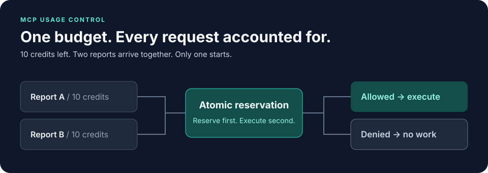

<div align="center">

# mcp-usage-control

**MCPツールの利用枠を、実行前の予約で守る。**

[](https://www.npmjs.com/package/mcp-usage-control)
[](https://github.com/git-ksk/mcp-usage-control/actions/workflows/ci.yml)
[](packages/core/package.json)
[](LICENSE)

[English](README.md) · [日本語](README.ja.md)

[クイックスタート](#クイックスタート) · [ドキュメント](docs/README.ja.md) · [実行例](examples/free-plus-credits/README.md) · [貢献する](CONTRIBUTING.ja.md)

</div>



Free/Plusのクレジット、ユーザーごとの利用上限、組織全体の共通予算をMCPツールに組み込めます。`mcp-usage-control` は処理の前に利用枠を一括で予約し、終了後に実際の使用量を確定するライブラリです。

残り10クレジットに対して10クレジットのレポートが2件同時に要求されても、開始できるのは1件だけ。有料処理の開始後にワーカーが落ちた場合は、不明な使用量を安易に返却しません。同じ処理の再試行では、再実行防止情報の保持期間中、別の予約を新たに作りません。

## できること

| 実現したいこと | 提供する仕組み |
| --- | --- |
| Free/Plusプランやツールごとのクレジット | アプリで定義できる消費量と利用上限 |
| ユーザー・組織・日次・月次の上限 | 関係するすべての利用枠を一括予約 |
| 同時実行や再試行への対応 | 原子的な予約と、同じ処理の重複予約防止 |
| 長時間処理や中断への対応 | 更新可能なリースと、障害時の保守的な使用量保持 |
| 既存インフラへの導入 | Memory・Redis・Cloudflare Durable Objects・Firestore |

コアはMCPに依存せず、独自の処理にも組み込めます。認証、サブスクリプション課金、請求、業務処理の重複実行防止はアプリ側が担当します。単純な「毎分何リクエスト」という制限だけなら、一般的なレートリミッターで十分です。

## クイックスタート

**Node.js 22以上 · ESM**

```sh
npm install mcp-usage-control
```

以下を `demo.mjs` に保存し、`node demo.mjs` で実行してください。データベースやAPIキーは不要です。

```js
import { MemoryUsageStore, UsageControl } from 'mcp-usage-control';

const control = new UsageControl(new MemoryUsageStore(), {
  quote: ({ principal }) => ({
    decision: 'allow',
    units: 10,
    budget: { key: `demo:${principal.id}`, limit: 10 },
  }),
});

const results = await Promise.all(
  ['report-a', 'report-b'].map(operationId => control.reserve({
    operationId,
    principal: { id: 'user-42' },
    tool: 'report',
    args: {},
  })),
);

console.log(results.map(result => result.allowed)); // [true, false]

for (const result of results) {
  if (result.allowed) {
    // このデモでは有料処理を実行していないため、予約を解放します。
    await result.lease.settle(0, 'success');
  }
}
```

この例は予約の動作を確認するものです。実際にリソースを消費する処理では、実行直前に `markLiable()` を呼び、終了後に実使用量を確定します。独自の長時間処理ではリースの更新が必要です。MCPラッパーは標準で更新を行います。

`MemoryUsageStore` の状態はプロセス内にあり、再起動で失われます。永続化や複数インスタンスでの共有が必要なら、外部ストアを使ってください。集計期間はアプリで定義し、新しい期間には別の予算キーを使います。

**次のステップ：** [導入ガイド](docs/getting-started.ja.md) / [`protectTool()` でMCPツールを保護する](docs/mcp-integration.ja.md)

### Free / Plusの実行例

Freeプランの残り10クレジットを2件のレポートが取り合うケースと、同じ処理の重複予約防止を自動検証します。

```sh
git clone https://github.com/git-ksk/mcp-usage-control.git
cd mcp-usage-control
pnpm install --frozen-lockfile
pnpm example:free-plus
```

リポジトリで指定するpnpm 10.15.0が必要です。

```text
PASS: Free plan stopped concurrent overspend at 50/50 credits.
PASS: duplicate logical operation was rejected instead of charging another 10 credits.
The same policy can quote Plus users at 500 credits/month.
```

[サンプルの詳細を見る →](examples/free-plus-credits/README.md)

## 仕組み


予約は **pending** で始まり、コストが発生し得る処理の直前で **cost-liable** に変わります。pendingのまま期限切れになった予約は解放できます。cost-liableになった後で実使用量が不明な場合は、予約した全量を保持します。

- **複数の利用枠を一括予約：** どれか1つでも不足していれば、予約全体を拒否します。
- **再試行には同じID：** 同じ処理には同じ `operationId` を使います。重複判定の範囲は `(tenantId, principal.id, tool, operationId)`。ユーザーと組織の識別情報は、信頼できる認証情報から取得します。
- **障害時も上限を守る：** ストアのエラーを実行許可に変えず、成否不明の書き込みを無条件に再試行しません。
- **複数ラウンドのMCP：** `protectMultiRoundTool()` は、改ざん検証済みの一度だけ使える状態を通じて元のリースを再開します。

詳しくは [アーキテクチャ](docs/architecture.ja.md) と [ストア実装契約](docs/store-contract.ja.md) を参照してください。利用量の制御は会計台帳ではなく、業務処理が必ず一度だけ実行されることを保証するものでもありません。

## パッケージを選ぶ

基本は **コア + 必要な連携アダプター + ストア1つ**。ローカルのデモはコアだけで動きます。

| パッケージ | 役割 | ガイド |
| --- | --- | --- |
| [`mcp-usage-control`](https://www.npmjs.com/package/mcp-usage-control) | コア、ポリシー、リース、Memoryストア | [API](docs/api-reference.ja.md) |
| [`mcp-usage-control-mcp`](https://www.npmjs.com/package/mcp-usage-control-mcp) | MCP TypeScript SDK v2のツールラッパー | [MCP連携](docs/mcp-integration.ja.md) |
| [`mcp-usage-control-redis`](https://www.npmjs.com/package/mcp-usage-control-redis) | Redis共有ストアとMCPフローの保存 | [Redis](docs/redis.ja.md) |
| [`mcp-usage-control-cloudflare`](https://www.npmjs.com/package/mcp-usage-control-cloudflare) | Durable Objects + SQLite | [Cloudflare](docs/cloudflare.ja.md) |
| [`mcp-usage-control-firestore`](https://www.npmjs.com/package/mcp-usage-control-firestore) | サーバー側のFirestoreトランザクション | [Firestore](docs/firestore.ja.md) |

たとえば、Redisを使うMCPサーバーなら：

```sh
npm install mcp-usage-control mcp-usage-control-mcp mcp-usage-control-redis
```

永続化、デプロイ、時計の同期、競合に関する条件は各ストアのガイドに記載しています。ソースやリリースtarballからの導入は [こちら](docs/using-from-source.ja.md)。

## 目的からドキュメントを探す

| やりたいこと | 読むページ |
| --- | --- |
| ツールに利用上限を付ける | [はじめに](docs/getting-started.ja.md) · [MCP連携](docs/mcp-integration.ja.md) · [Operation identity](docs/mcp-operation-identity.ja.md) |
| Free/Plusの月次クレジットを作る | [サブスク型クレジット](docs/subscription-credits.ja.md) · [集計期間のキー](docs/accounting-window-keys.ja.md) |
| 途中で増える消費量や異なる単位を扱う | [段階的な予約拡張](docs/progressive-mcp-integration.ja.md) · [利用量ベクトル](docs/vector-usage.ja.md) |
| 利用状況や障害を調べる | [トラブルシューティング](docs/troubleshooting.ja.md) · [可観測性](docs/observability.ja.md) · [状態の照合](docs/operation-reconciliation.ja.md) |
| 独自のストアを実装する | [ストア実装契約と適合性検証](docs/store-contract.ja.md) |
| 対応範囲やリリースの検証結果を確認する | [v1検証結果](docs/v1-readiness.ja.md) · [変更履歴](CHANGELOG.md) · [ロードマップ](docs/roadmap.ja.md) |

[ドキュメント一覧へ →](docs/README.ja.md)

## プロジェクトの状態

5パッケージは **v1.1.0のGitHub/source release**を基準としています。npm registry baselineは、separate authorizationされたv1.1.0 Trusted Publishing workflowが完了するまで **v1.0.0** のままです。CIではNode.js 22/24、Redis、MCP SDK v2連携、Cloudflareのローカル/workerd環境、Firestore Emulator、パッケージの利用側での検証を扱います。確認範囲の詳細は [リリース検証結果](docs/v1-readiness.ja.md) を参照してください。

単一ラウンドと複数ラウンドのMCP利用量管理に対応しています。MCP Tasksの安定版専用アダプターは未提供です。定義済みの処理モデルは [Tasksの利用量管理](docs/mcp-tasks-accounting.ja.md) にまとめています。

## 貢献・サポート

不具合報告、ドキュメントの改善、サンプル、焦点を絞ったプルリクエストを歓迎します。開発環境と検証方法は [貢献ガイド](CONTRIBUTING.ja.md) をご覧ください。

- **不具合・機能の提案：** [Issueを作成](https://github.com/git-ksk/mcp-usage-control/issues/new/choose)。
- **使い方・サポート：** [サポートガイド](SUPPORT.ja.md)。
- **脆弱性：** [セキュリティポリシー](SECURITY.ja.md) の非公開の報告手順に従ってください。

参加にあたっては [行動規範](CODE_OF_CONDUCT.ja.md) をご確認ください。ライセンスは [Apache-2.0](LICENSE) です。
