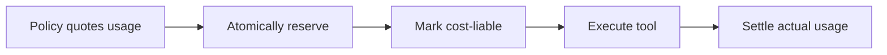

<div align="center">

# mcp-usage-control

**Usage limits for MCP tools. Reserve before you run.**

[](https://www.npmjs.com/package/mcp-usage-control)
[](https://github.com/git-ksk/mcp-usage-control/actions/workflows/ci.yml)
[](packages/core/package.json)
[](LICENSE)

[English](README.md) · [日本語](README.ja.md)

[Quick start](#quick-start) · [Documentation](docs/README.md) · [Examples](examples/free-plus-credits/README.md) · [Contributing](CONTRIBUTING.md)

</div>


Give your MCP tools Free/Plus credits, per-user quotas, and shared tenant budgets. `mcp-usage-control` reserves capacity atomically before work starts, then settles actual usage afterward.

When two reports compete for the last 10 credits, only one starts. When a worker crashes after paid work may have begun, unknown usage is retained conservatively. Retrying the same logical operation does not create a second independent reservation during replay retention.

## Why use it?

| Your product needs | What you get |
| --- | --- |
| Free/Plus plans and metered tools | Application-defined credit costs and budget limits |
| User, tenant, daily, and monthly limits | Reserve across all participating budgets, or none |
| Concurrent requests and retries | Atomic admission and scoped operation replay protection |
| Long-running or interrupted work | Renewable leases and conservative crash recovery |
| Your existing infrastructure | Memory, Redis, Cloudflare Durable Objects, or Firestore |

The core is independent of MCP and can also serve custom integrations. Authentication, subscription billing, invoicing, and business-side-effect replay belong to your application. For requests-per-minute throttling alone, a simple rate limiter is usually enough.

## Quick start

**Node.js 22+ · ESM**

```sh
npm install mcp-usage-control
```

Save this as `demo.mjs` and run `node demo.mjs`. No database or API key needed.

```js
import { MemoryUsageStore, UsageControl } from 'mcp-usage-control';

const control = new UsageControl(new MemoryUsageStore(), {
  quote: ({ principal }) => ({
    decision: 'allow',
    units: 10,
    budget: { key: `demo:${principal.id}`, limit: 10 },
  }),
});

const results = await Promise.all(
  ['report-a', 'report-b'].map(operationId => control.reserve({
    operationId,
    principal: { id: 'user-42' },
    tool: 'report',
    args: {},
  })),
);

console.log(results.map(result => result.allowed)); // [true, false]

for (const result of results) {
  if (result.allowed) {
    // No paid work ran in this demo: release the reservation.
    await result.lease.settle(0, 'success');
  }
}
```

This demonstrates admission only. For metered work, call `markLiable()` immediately before execution and settle actual usage afterward. Long-running custom integrations must renew active leases; the MCP wrapper handles renewal by default.

`MemoryUsageStore` is process-local and loses state on restart. Use a shared provider-backed store for durable or multi-instance enforcement. Budget windows are application-defined; a new window needs its own budget key.

**Next:** [Build your first integration](docs/getting-started.md) or [wrap an MCP tool with `protectTool()`](docs/mcp-integration.md).

### Run the Free / Plus example

A self-verifying example races two reports for the last 10 Free credits, then checks duplicate-operation protection:

```sh
git clone https://github.com/git-ksk/mcp-usage-control.git
cd mcp-usage-control
pnpm install --frozen-lockfile
pnpm example:free-plus
```

Requires pnpm 10.15.0, as pinned in the repository.

```text
PASS: Free plan stopped concurrent overspend at 50/50 credits.
PASS: duplicate logical operation was rejected instead of charging another 10 credits.
The same policy can quote Plus users at 500 credits/month.
```

[Explore the example →](examples/free-plus-credits/README.md)

## How it works



A reservation starts **pending**. Immediately before work may incur cost, it becomes **cost-liable**. Expired pending reservations can release capacity; expired cost-liable reservations retain the full reserved amount when actual usage is unknown.

- **All-or-nothing budgets:** one exhausted budget prevents the entire reservation.
- **Stable retry identity:** reuse `operationId` for the same logical operation. Replay scope is `(tenantId, principal.id, tool, operationId)`; identity must come from trusted authentication context.
- **Conservative failures:** storage errors do not become allow decisions, and ambiguous writes are not blindly retried.
- **Multi-round MCP:** `protectMultiRoundTool()` resumes the existing lease using integrity-verified, one-time flow state.

See the [architecture](docs/architecture.md) and [Store contract](docs/store-contract.md) for the full accounting rules. Usage enforcement is not a financial ledger or a guarantee of exactly-once business execution.

## Choose your packages

Install **core + the integration you need + one store**. Start with core alone for the local demo.

| Package | Role | Guide |
| --- | --- | --- |
| [`mcp-usage-control`](https://www.npmjs.com/package/mcp-usage-control) | Core engine, policies, leases, Memory store | [API](docs/api-reference.md) |
| [`mcp-usage-control-mcp`](https://www.npmjs.com/package/mcp-usage-control-mcp) | MCP TypeScript SDK v2 tool wrappers | [MCP integration](docs/mcp-integration.md) |
| [`mcp-usage-control-redis`](https://www.npmjs.com/package/mcp-usage-control-redis) | Shared Redis store and MCP flow store | [Redis](docs/redis.md) |
| [`mcp-usage-control-cloudflare`](https://www.npmjs.com/package/mcp-usage-control-cloudflare) | Durable Objects + SQLite | [Cloudflare](docs/cloudflare.md) |
| [`mcp-usage-control-firestore`](https://www.npmjs.com/package/mcp-usage-control-firestore) | Server-side Firestore transactions | [Firestore](docs/firestore.md) |

For example, an MCP server backed by Redis:

```sh
npm install mcp-usage-control mcp-usage-control-mcp mcp-usage-control-redis
```

Provider guides cover persistence, deployment, clock, and contention requirements. For repository or release-tarball installs, see [Use from source](docs/using-from-source.md).

## Explore the docs

| I want to… | Start here |
| --- | --- |
| Add usage limits to a tool | [Getting started](docs/getting-started.md) · [MCP integration](docs/mcp-integration.md) |
| Implement Free/Plus monthly credits | [Subscription credits](docs/subscription-credits.md) · [Window keys](docs/accounting-window-keys.md) |
| Meter growing or mixed-unit workloads | [Progressive usage](docs/progressive-mcp-integration.md) · [Usage vectors](docs/vector-usage.md) |
| Diagnose usage and failures | [Troubleshooting](docs/troubleshooting.md) · [Observability](docs/observability.md) · [Reconciliation](docs/operation-reconciliation.md) |
| Build a storage adapter | [Store contract and conformance](docs/store-contract.md) |
| Review support and release evidence | [v1 readiness](docs/v1-readiness.md) · [Changelog](CHANGELOG.md) · [Roadmap](docs/roadmap.md) |

[Browse all documentation →](docs/README.md)

## Project status

The five packages use the **v1.0.0 stable baseline**. CI covers Node.js 22/24, Redis, MCP SDK v2 integration, Cloudflare local/workerd, Firestore Emulator, and package-consumer checks. See [release evidence](docs/v1-readiness.md) for the scope of validation.

Single-round and multi-round MCP accounting are supported. A stable first-class MCP Tasks adapter remains deferred; see [Tasks accounting](docs/mcp-tasks-accounting.md) for the defined lifecycle boundary.

## Contribute and get help

Bug reports, documentation improvements, examples, and focused pull requests are welcome. Start with the [contributing guide](CONTRIBUTING.md) for local setup and verification.

- **Bug or feature idea:** [Open an issue](https://github.com/git-ksk/mcp-usage-control/issues/new/choose).
- **Usage and support:** read the [support guide](SUPPORT.md).
- **Security vulnerability:** follow the private reporting process in [SECURITY.md](SECURITY.md).

Participation follows our [Code of Conduct](CODE_OF_CONDUCT.md). Licensed under [Apache-2.0](LICENSE).
